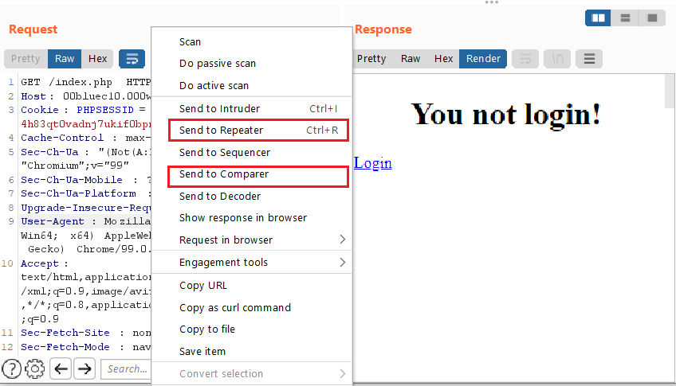
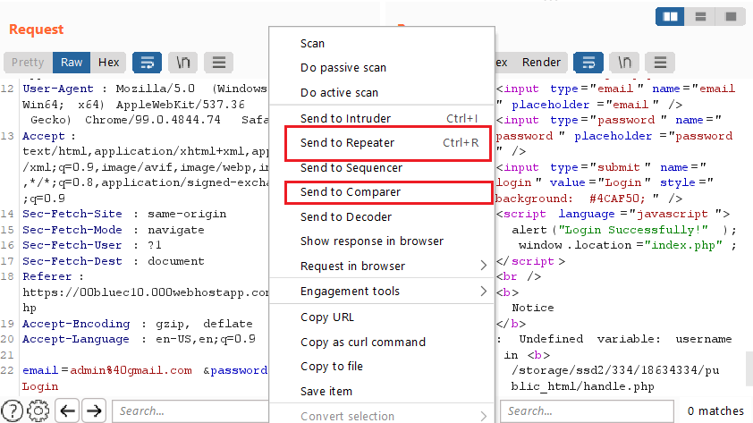
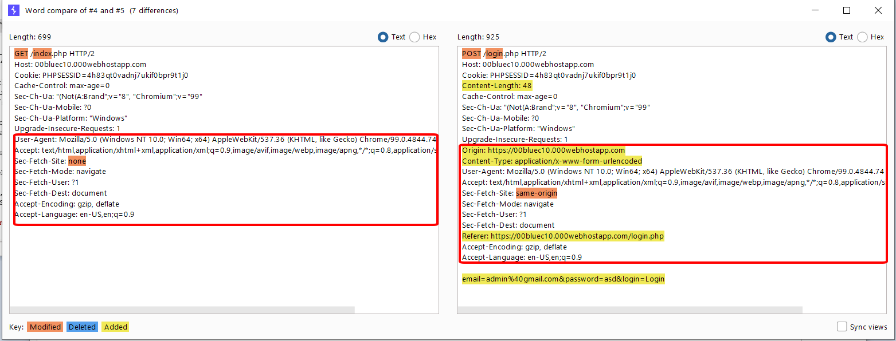
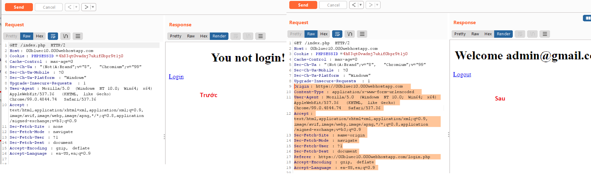
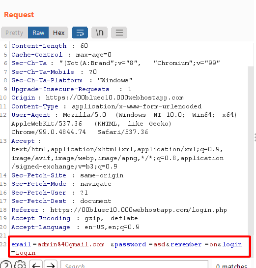
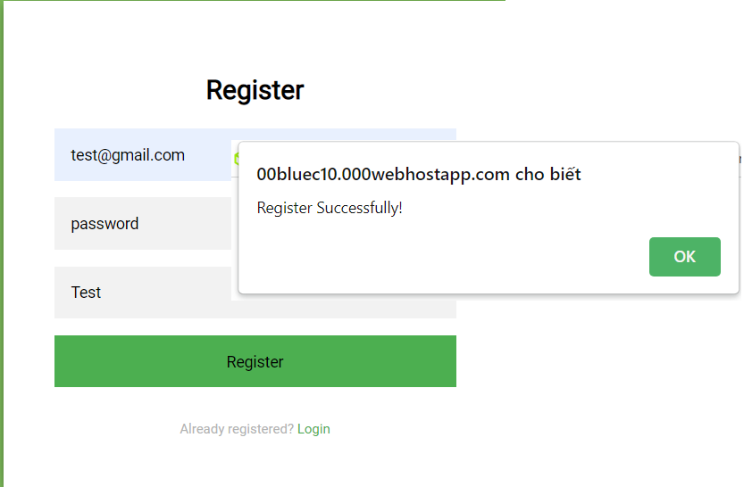
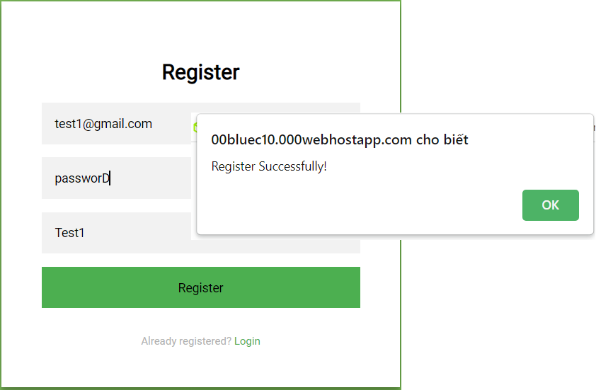
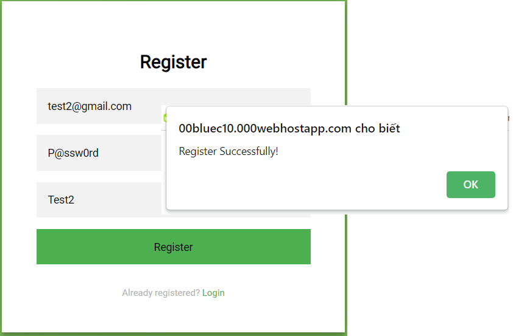
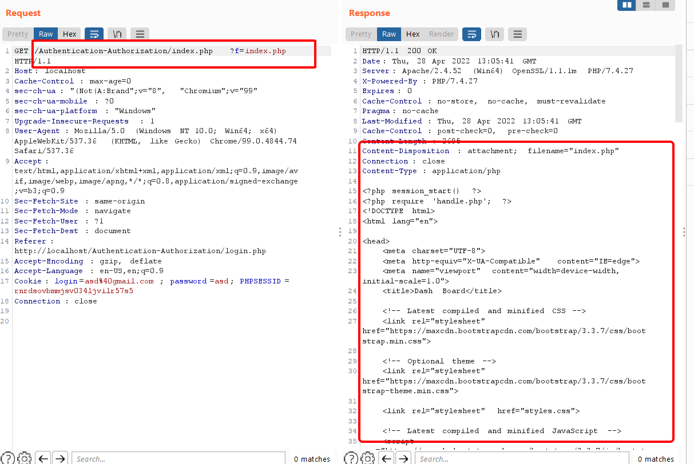

Người thực hiện: Lê Trần Văn Chương.

Thời gian: 21/04/2022.

Mục lục:
- [Authentication - Authorization](#authentication---authorization)
- [Lab](#lab)
  - [Authentication](#authentication)
    - [Testing for Credentials Transported over an Encrypted Channel (OTG-AUTHN-001)](#testing-for-credentials-transported-over-an-encrypted-channel-otg-authn-001)
    - [Testing for default credentials (OTG-AUTHN-002)](#testing-for-default-credentials-otg-authn-002)
    - [Testing for Weak lock out mechanism (OTG-AUTHN-003)](#testing-for-weak-lock-out-mechanism-otg-authn-003)
    - [Testing for bypassing authentication schema (OTG-AUTHN-004)](#testing-for-bypassing-authentication-schema-otg-authn-004)
    - [Test remember password functionality (OTG-AUTHN-005)](#test-remember-password-functionality-otg-authn-005)
    - [Testing for Browser cache weakness (OTG-AUTHN-006)](#testing-for-browser-cache-weakness-otg-authn-006)
    - [Testing for Weak password policy (OTG-AUTHN-007)](#testing-for-weak-password-policy-otg-authn-007)
    - [Testing for Weak security question/answer (OTG-AUTHN-008)](#testing-for-weak-security-questionanswer-otg-authn-008)
    - [Testing for weak password change or reset functionalities (OTG-AUTHN-009)](#testing-for-weak-password-change-or-reset-functionalities-otg-authn-009)
    - [Testing for Weaker authentication in alternative channel (OTG-AUTHN-010)](#testing-for-weaker-authentication-in-alternative-channel-otg-authn-010)
  - [Authorization](#authorization)
    - [Testing Directory traversal/file include (OTG-AUTHZ-001)](#testing-directory-traversalfile-include-otg-authz-001)
    - [Testing for bypassing authorization schema (OTG-AUTHZ-002)](#testing-for-bypassing-authorization-schema-otg-authz-002)
    - [Testing for Privilege Escalation (OTG-AUTHZ-003)](#testing-for-privilege-escalation-otg-authz-003)
    - [Testing for Insecure Direct Object References (OTG-AUTHZ-004)](#testing-for-insecure-direct-object-references-otg-authz-004)

## Authentication - Authorization
- Authentication (xác thực) nghĩa là xác minh danh tính của user.
- Authorization (ủy quyền) nghĩa là cấp quyền truy cập và hệ thống (user có quyền gì trong hệ thống).

| Authentication  | Authorization |
| ------------- |---------------|
| Authentication xác nhận danh tính của bạn để cấp quyền truy cập vào hệ thống.      | Authorization xác định xem bạn có được phép truy cập tài nguyên không.     |
| Đây là quá trình xác nhận thông tin đăng nhập để có quyền truy cập của người dùng.      | Đó là quá trình xác minh xem có cho phép truy cập hay không.     |
| Nó quyết định liệu người dùng có phải là những gì anh ta tuyên bố hay không.     | Nó xác định những gì người dùng có thể và không thể truy cập.    |
| Authentication thường yêu cầu tên người dùng và mật khẩu.     | Các yếu tố xác thực cần thiết để authorization có thể khác nhau, tùy thuộc vào mức độ bảo mật.     |
| Authentication là bước đầu tiên của authorization vì vậy luôn luôn đến trước.      | Authorization được thực hiện sau khi authentication thành công.    |

## Lab
Link: https://00bluec10.000webhostapp.com/index.php

### Authentication
#### Testing for Credentials Transported over an Encrypted Channel (OTG-AUTHN-001)
Tôi sử dụng `Burp Suite` để có thể bắt được các gói `header` và kiểm tra chúng.

#### Testing for default credentials (OTG-AUTHN-002)
- Sử dụng `intruder` của `Burp Suite` để có thể payload `email` và `password`. Tôi sử dụng chế độ `Cluster bomb` để có thể đặt nhiều payload trong 1 lần và tiết kiệm thời gian. 

- Tôi sử dụng 2 list sau để payload.

- Kết quả, tôi chỉ cần kiểm tra `Response` có chữ `Xin chào` hay không để có thể biết tài khoản này dùng được không.

#### Testing for Weak lock out mechanism (OTG-AUTHN-003)
Để kiểm tra cơ chế khóa tài khoản, bạn cần phải có 1 tài khoản để có thể vào được. Sau đó tiến hành kiểm tra như sau:
- Đăng nhập tài khoản bằng mật khẩu ko chính xác 3 lần, rồi đăng nhập lại bằng mật khẩu chính xác: 
  - Nếu đăng nhập thành công, cho thấy rằng cơ chế khóa không kích hoạt sau 3 lần xác thực không chính xác. Và ta cứ tiếp tục tăng số lần nhập mật khẩu sai lên đến khi `Tài khoản bị khóa`.
  - Nếu ứng dụng trả về `Tài khoản bị khóa` thì xác nhận rằng tài khoản đã bị khóa sau 3 lần xác thực sai.

#### Testing for bypassing authentication schema (OTG-AUTHN-004)
- Tiếp tục sử dụng `Burp Suite` để có thể lấy được `header` của web.
- Dùng `Send to Repeater` để có thể gửi request từ `Burp Suite` và `Send to Comparer` để kiểm tra sự thay đổi của `header` khi tôi login thành công.

- Dưới là bảng so sánh 2 `header`

- Bây giờ, tôi sẽ copy phần thay đổi khi login thành công và paste vào phần `header` khi chưa login. Và kết quả ở dưới.

#### Test remember password functionality (OTG-AUTHN-005)
Sử dụng `Burp Suite` để kiểm tra các cookie được ứng dụng lưu trữ. Ở đây, nó không được mã hóa hoặc băm gì hết.

#### Testing for Browser cache weakness (OTG-AUTHN-006)
- Về mặt kỹ thuật, nút "Back" là lịch sử chứ không phải bộ nhớ cache. Bộ nhớ cache và lịch sử là hai thực thể khác nhau. Tuy nhiên, chúng có chung điểm yếu là đưa ra những thông tin nhạy cảm đã được hiển thị trước đó.
- Thử nghiệm đầu tiên và đơn giản nhất bao gồm nhập thông tin nhạy cảm vào ứng dụng và đăng xuất. Sau đó, người kiểm tra nhấp vào nút "Quay lại" của trình duyệt để kiểm tra xem thông tin nhạy cảm được hiển thị trước đó có thể được truy cập trong khi chưa được xác thực hay không.
- Nếu bằng cách nhấn nút "Quay lại" mà người kiểm tra có thể truy cập các trang trước đó nhưng không truy cập được các trang mới, thì đó không phải là vấn đề xác thực mà là vấn đề lịch sử trình duyệt. Nếu các trang này chứa dữ liệu nhạy cảm, điều đó có nghĩa là ứng dụng đã không cấm trình duyệt lưu trữ dữ liệu đó.

#### Testing for Weak password policy (OTG-AUTHN-007)
Độ yếu của passsword chia ra làm 3 level:

- `Level 1`: password là `password` toàn những ký tự thường. Password ở đây khá tệ, vì với password toàn những chữ cái thường như `password` mà không có ký tự đặc biệt hoặc in hoa thì thường dễ bị tấn công vét cạn. Giả sử, ở `Level 1` này không thể register thì ta chuyển sang `Level 2`.

- `Level 2`: password là `passworD` có thêm ký tự in hoa là 'D'. Vì password này, có thêm ký tự in hoa nên khả năng vét cạn sẽ tốn nhiều thời gian hơn. Giả sử, ở `Level 2` này không thể register thì ta chuyển sang `Level 3`.

- `Level 3`: password là `P@sw0rd` vừa có ký tự thường, in hoa, số và ký tự đặc biệt nhưng ít hơn 8 ký tự. Web vẫn tiếp tục cho register.

Đây là 1 lỗi bảo mật `password`.

#### Testing for Weak security question/answer (OTG-AUTHN-008)
- **Kiểm tra các câu hỏi yếu được tạo trước**: Cố gắng lấy danh sách các câu hỏi bảo mật bằng cách tạo tài khoản mới hoặc làm theo quy trình "I don't remember my password". Cố gắng tạo càng nhiều câu hỏi càng tốt để hiểu rõ về loại câu hỏi bảo mật được hỏi.
- **Kiểm tra các câu hỏi tự tạo yếu**: Cố gắng tạo các câu hỏi bảo mật bằng cách tạo một tài khoản mới hoặc bằng cách định cấu hình các thuộc tính khôi phục mật khẩu hiện tại của tài khoản của bạn. Nếu hệ thống cho phép người dùng tạo các câu hỏi bảo mật của riêng họ, thì rất dễ bị tạo ra các câu hỏi không an toàn. Nếu hệ thống sử dụng các câu hỏi bảo mật tự tạo trong chức năng quên mật khẩu và nếu tên người dùng có thể được liệt kê, thì người kiểm tra sẽ dễ dàng liệt kê một số câu hỏi tự tạo. Có thể hy vọng sẽ tìm thấy một số câu hỏi tự tạo yếu bằng phương pháp này.
- **Kiểm tra các câu trả lời brute-forcible**: Sử dụng các phương pháp được OTG-AUTHN-003 để xác định xem một số câu trả lời bảo mật được cung cấp không chính xác có kích hoạt cơ chế khóa hay không.

#### Testing for weak password change or reset functionalities (OTG-AUTHN-009)
Đối với cả việc thay đổi mật khẩu và đặt lại mật khẩu, điều quan trọng là phải kiểm tra:

- Nếu người dùng, không phải là quản trị viên, có thể thay đổi hoặc đặt lại mật khẩu cho các tài khoản khác với tài khoản của họ.
- Nếu người dùng có thể thao túng hoặc phá hoại quá trình thay đổi hoặc đặt lại mật khẩu để thay đổi hoặc đặt lại mật khẩu của người dùng hoặc quản trị viên khác.
- Nếu quá trình thay đổi hoặc đặt lại mật khẩu dễ bị CSRF.

**Kiểm tra Đặc lại password**: điều quan trọng là phải xác minh những điều sau:
- Thông tin nào được yêu cầu để đặt lại mật khẩu?
- Mật khẩu đặt lại được giao tiếp với người dùng như thế nào?
- Đặt lại mật khẩu có được tạo ngẫu nhiên không?
- Chức năng đặt lại mật khẩu có yêu cầu xác nhận trước khi thay đổi mật khẩu không?

**Kiểm tra thay đổi mật khẩu**: Ngoài bài kiểm tra trước đó, điều quan trọng là phải xác minh: Mật khẩu cũ có được yêu cầu để hoàn tất việc thay đổi không?

#### Testing for Weaker authentication in alternative channel (OTG-AUTHN-010)
Chưa hiểu lắm

### Authorization
#### Testing Directory traversal/file include (OTG-AUTHZ-001)
- Đầu tiên, phải load trang bằng `Burp Suite` để có thể lấy được header của lab. Và thêm sau url `?f=index.php`.

- Tiếp theo, sử dụng `Send to Repeater` của `Burp Suite` để có thể thêm `?f=../../test.txt` để xem dữ liệu của tệp.

Ngoài ra, tùy vào từng trường hợp mà bạn có thể sử dụng `/etc/passwd`, `....//....//....//etc/passwd`, `..%252f..%252f..%252fetc/passwd`, `var/www/images/../../../etc/passwd`, `../../../etc/passwd%00.png`.

#### Testing for bypassing authorization schema (OTG-AUTHZ-002)

#### Testing for Privilege Escalation (OTG-AUTHZ-003)

#### Testing for Insecure Direct Object References (OTG-AUTHZ-004)

