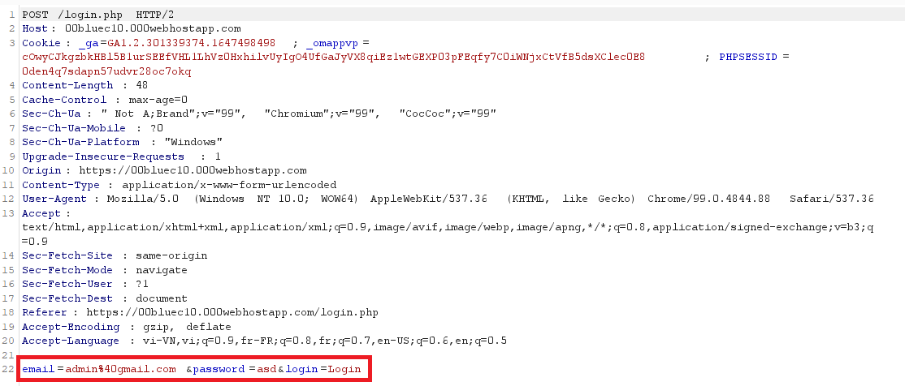
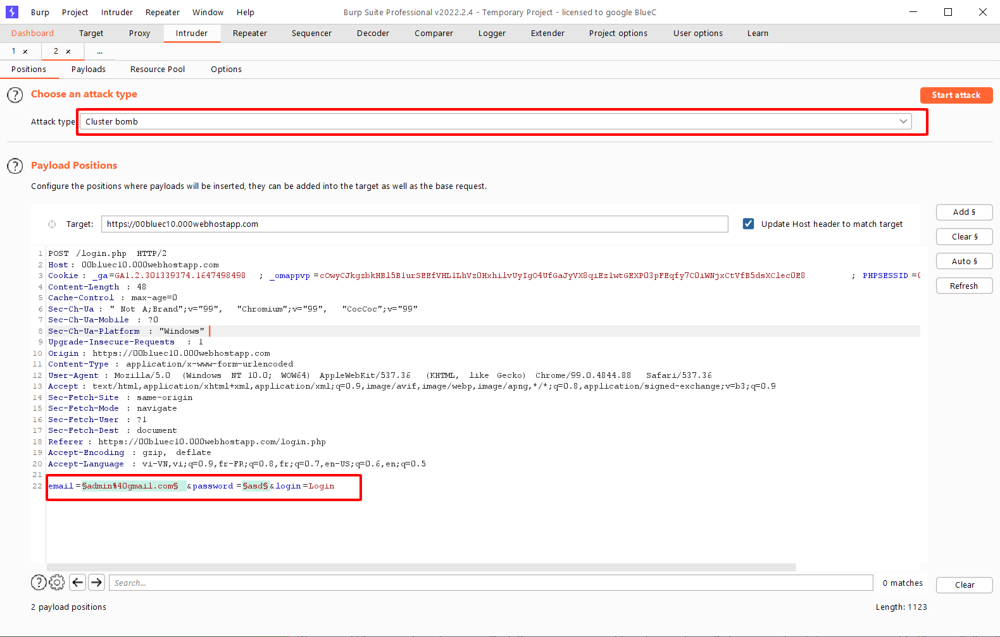
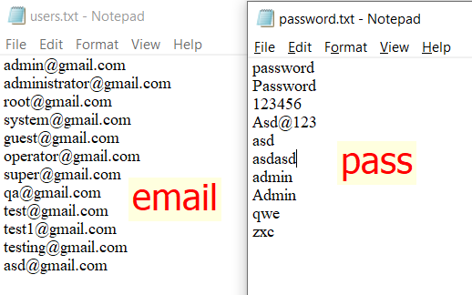
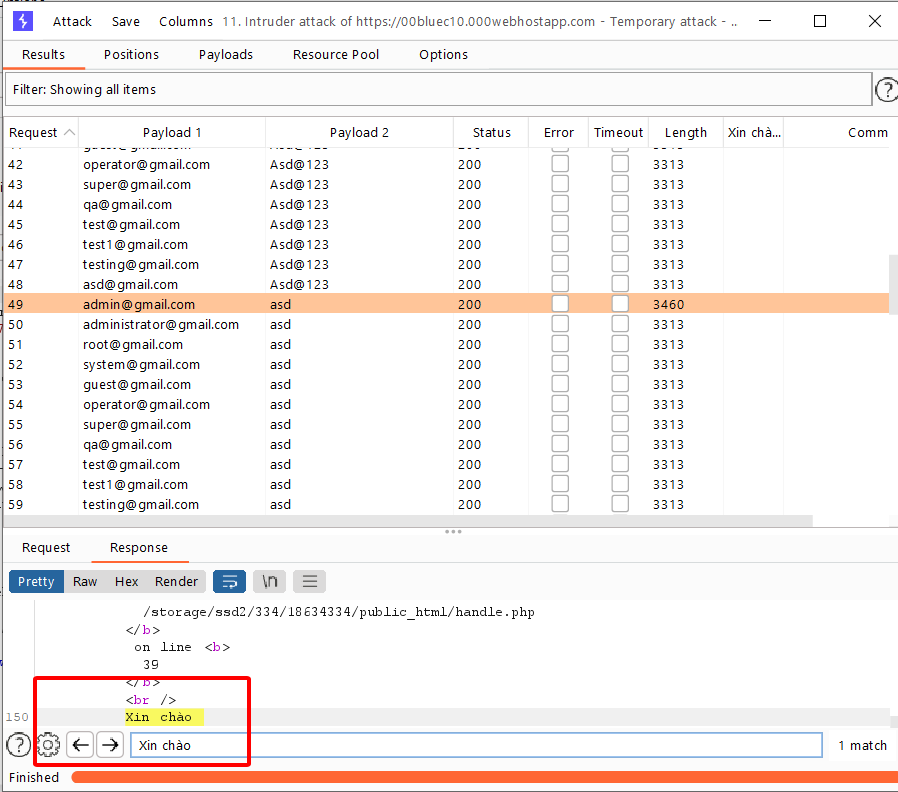

Người thực hiện: Lê Trần Văn Chương
Thời gian: 21/04/2022
Mục lục:
- [Authentication - Authorization](#authentication---authorization)
- [Lab](#lab)
  - [Authentication](#authentication)
    - [OTG-AUTHN-001](#otg-authn-001)
    - [OTG-AUTHN-002](#otg-authn-002)
  - [Authorization](#authorization)

## Authentication - Authorization
- Authentication (xác thực) nghĩa là xác minh danh tính của user.
- Authorization (ủy quyền) nghĩa là cấp quyền truy cập và hệ thống (user có quyền gì trong hệ thống).

| Authentication  | Authorization |
| ------------- |---------------|
| Authentication xác nhận danh tính của bạn để cấp quyền truy cập vào hệ thống.      | Authorization xác định xem bạn có được phép truy cập tài nguyên không.     |
| Đây là quá trình xác nhận thông tin đăng nhập để có quyền truy cập của người dùng.      | Đó là quá trình xác minh xem có cho phép truy cập hay không.     |
| Nó quyết định liệu người dùng có phải là những gì anh ta tuyên bố hay không.     | Nó xác định những gì người dùng có thể và không thể truy cập.    |
| Authentication thường yêu cầu tên người dùng và mật khẩu.     | Các yếu tố xác thực cần thiết để authorization có thể khác nhau, tùy thuộc vào mức độ bảo mật.     |
| Authentication là bước đầu tiên của authorization vì vậy luôn luôn đến trước.      | Authorization được thực hiện sau khi authentication thành công.    |

## Lab
Link: https://00bluec10.000webhostapp.com/login.php

### Authentication
#### OTG-AUTHN-001
Tôi sử dụng `Burp Suite` để có thể bắt được các gói `header` và kiểm tra chúng.

#### OTG-AUTHN-002
- Sử dụng `intruder` của `Burp Suite` để có thể payload `email` và `password`. Tôi sử dụng chế độ `Cluster bomb` để có thể đặt nhiều payload trong 1 lần và tiết kiệm thời gian. 

- Tôi sử dụng 2 list sau để payload

- Kết quả, tôi chỉ cần kiểm tra `Response` có chữ `Xin chào` hay không để có thể biết tài khoản này dùng được không.

### Authorization

